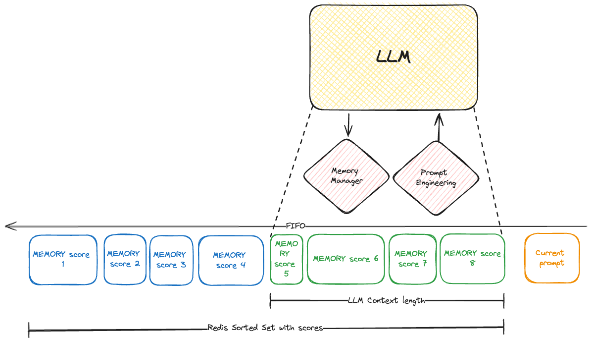

## A Chat bot with memory using spin-js-sdk

By default, chat bots powered by LLMs are stateless, which means that they don't remember what was said before. Also, this app using will be deployed as a serverless WASM module, which also means that it will be stateless by default.

This is a simple demo shows how to combine outbound Redis and the serverless-ai functionality of the spin-js-sdk to create a chat bot with memory.

It also supports multiple users/session, the only limit is Redis's memory :) Theoretically you could have millions of users at the same time while benefiting from the speed of WASM and the serverless architecture.


    
### Prerequisites

- [Spin CLI](https://www.fermyon.com/spin)
- [Fermyon Cloud Account](https://www.fermyon.com/spin)
- You will also need a Redis Server, by using this [link](https://go.aiven.io/aiven-redis-adding-memory) you can get a free Redis Server for ever + 400$ credits to try out all the other services on Aiven.

### Configuration
Once you have your Redis Server up and running, you will have to set the correct Redis address both in the `spin.toml` and in the `src/index.js` file. 

Context length : in src/index.js you can set the context length, which is the number of tokens that will be used to store the context of the conversation. It will be optimized during the conversation using a simple FIFO algorithm, so that the context length is always below the maximum allowed to keep the conversation going.

### Build

```console
npm install
spin build
```

### Run on Fermyon's Cloud

```console
spin cloud deploy
```

### Run locally

Install the [Spin Cloud GPU Plugin](https://github.com/fermyon/spin-cloud-gpu/) and follow the instructions

```console
spin up --runtime-config-file <name-of-your-runtime-config-file>
```

Or, use `spin watch` to run the app and rebuild on any changes to `package.json` or the files in `src`.

### Usage

Once the app is running, you can access it at the URL shown in the output of `spin up` or `spin watch`. 
To init a new conversation, send a request that contains the `context` field, i.e : 

```bash
curl -d '{"context":"You are a bot that must try to find a famous person by asking questions to the user.", "prompt":"Hi I am Seb , you can ask me the first question to guess who I have in mind"}' http://127.0.0.1:3000/
```

You will get a response that contains the `id` field, which is the id of the conversation you just started. 

```json
{
  "id":50,
  "prompt":"Hi I am Seb , you can ask me the first question to guess who I have in mind",
  "context":"You are a bot that must try to find a famous person by asking questions to the user.",
  "reply":"Great! Let's get started. Here's my first question:Are you thinking of a female celebrity?",
  "numberOfTokens":124
}

```

You can then reuse this `id` to continue the conversation, i.e : 

```bash

curl -d '{"id":50, "prompt":"yes"}' http://127.0.0.1:3000    

```

To start a new conversation, just send a request that contains the `context` field without the `id` field. 

Multiple conversations can be held at the same time, just make sure to use the correct `id` for each conversation.